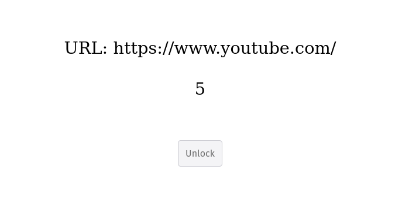
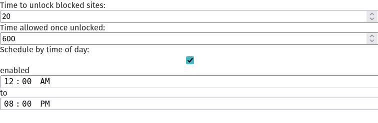
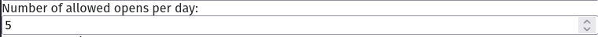
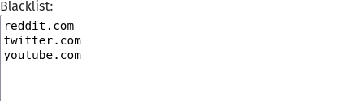
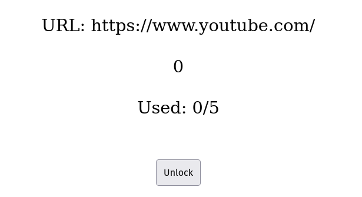
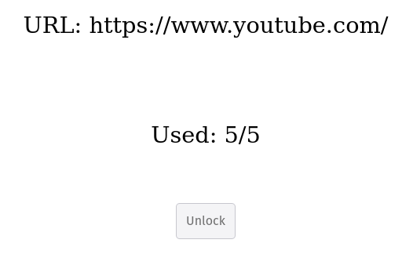

[Friction](https://addons.mozilla.org/en-US/firefox/addon/friction/?utm_source=addons.mozilla.org&utm_medium=referral&utm_content=search) is a very simple browser extension. It forces you to wait for a short time before accessing blacklisted sites. While this greatly helps against impulse opening YouTube or other time-wasting sites, it still allows patient people to wait until the timer runs out and fuel their bad browsing habits. Mobile apps like [ScreenZen](https://www.screenzen.co/) solve this issue by only allowing you to open blacklisted apps a specified number of times. After some searching, I wasn't able to find a Firefox extension with similar features, so I decided to add them myself.

## How it works now

Surfing to one of the blacklisted sites redirects you to this page.



After the timer below the URL runs out, you're able to continue to the website by clicking the unlock button.

## Adding the feature

Friction only has a couple of settings.



To these, I added the maximum number of allowed opens per day.



Extensions store this type of information using some built-in browser functions.


```js
chrome.storage.get(['allowedopens']);
chrome.storage.set({'allowedopens': allowedOpens});
```

In the settings, the user also defines which sites must be blacklisted. 



Each one of these sites can be opened a number of times, which is stored inside of a simple object.

```js
{
  'youtube.com': 5,
  'reddit.com': 5,
  'twitter.com': 5,
}
```

Showing the number of used opens on the unlock page yields the following result.



With every unlock the remaining number of unlocks decreases. When the number of allowed unlocks for the day is reached, the site is completely blocked and no timer is shown.



The number of allowed unlocks is then reset at midnight.

My fork of the extensions can be viewed [here](https://github.com/lucasotodegraeve/friction/tree/limit-opens).

## Possible further development
Some other cool features would be:
- dark mode
- the ability to manage groups of sites, where each group has their own options
- a youtube specific setting that limits the number of videos you're allowed to watch


