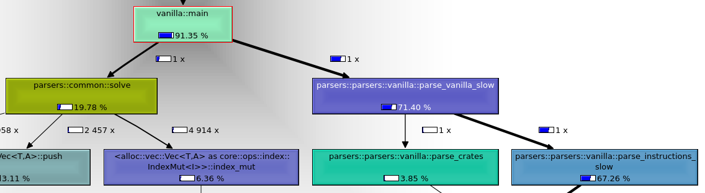
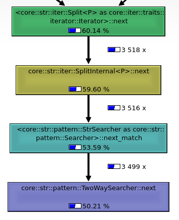

<style>
.white-bg {
  background-color: white;
  border-radius: .375rem;
}
.image-container {
  display: flex;
  max-width: 100%;
}
.image-container img {
  width: 33.33%
}
</style>


<div class="image-container white-bg">
</img>
</img>
</img>
</div>

Three main options come to mind when it comes to parsing in Rust: [nom](https://github.com/rust-bakery/nom), [pest](https://pest.rs/) and simple vanilla Rust. Let's compare them.

## What to parse

Let's take a [problem from Advent of Code](https://adventofcode.com/2022/day/5) as the string to parse. The input looks something like this:

```
    [D]    
[N] [C]    
[Z] [M] [P]
 1   2   3 

move 1 from 2 to 1
move 3 from 1 to 3
move 2 from 2 to 1
move 1 from 1 to 2

```

The first part represents three stacks of crates. The second part is a list of instructions on how to move the crates.

## Nom

Nom works by composing parsers. For example, to parse a single crate `[X]` the following parser is used:

```rust
// parser for "[X]"
delimited(
  tag("["), 
  take(1u8), 
  tag("]")
);
```

Both `tag` and `take` are parsers that are composed inside of the `delimited` parser. This parser will only return the inside letter of a crate and discard the rest.

A parser for a single line of the move instructions has to following shape:

```rust 
// parser for "move 1 from 2 to 1"
tuple((
  preceded(tag("move "), u32), // "move" precedes "1"
  preceded(tag(" from "), u32), // "from" precedes "2"
  preceded(tag(" to "), u32), // "to" precedes "1"
)) // All inside a tuple
```

The cool thing is that `u32` here is actually also a parser that will automatically parse the string into an integer for you. As you can see it's all about composability. 

Resources: [nom repository](https://github.com/rust-bakery/nom), [documentation](https://docs.rs/nom/latest/nom/), [list of parsers](https://github.com/rust-bakery/nom/blob/e87c7da9fa2ddb943306369f6c6d9e914256edbc/doc/choosing_a_combinator.md)

## Pest

Parsers are defined in a special `.pest` file. The parsing of a simple crate `[X]` is done using

```pest
box = { "[" ~ ASCII_ALPHA_UPPER ~ "]" }
```

and a single move instruction

```pest
stack_number = { ASCII_DIGIT+ }
amount = { ASCII_DIGIT+ }
instr = { "move " ~ amount ~ " from " ~ stack_number ~ " to " ~ stack_number}
```

It is quite easy to read and write this syntax. However, the Rust code to run the parser must still be run. The function to convert the strings into integers is

```rust
fn parse_move(mut pairs: Pairs<Rule>) -> Instruction {
    let amount = pairs.next().unwrap().as_str().parse::<u32>().unwrap();
    let from = pairs.next().unwrap().as_str().parse::<usize>().unwrap();
    let to = pairs.next().unwrap().as_str().parse::<usize>().unwrap();

    Instruction { amount, from, to }
}
```

It's pretty ugly. Also, if you make a change in the `.pest` file you also have to make changes in your code. 

Resources: [playground](https://pest.rs/), [documentation](https://docs.rs/pest/latest/pest/), [book](https://pest.rs/book/).

## Vanilla
Good 'ol vanilla. You don't have to learn anything new. Just use the reliable `.split`. It's also a bit more compact than the libraries.

Parsing not only a single crate but all of them with
```rust
// parses all the crates
s.split("\n")
.map(|s| s.chars().skip(1).step_by(4).collect::<Vec<_>>())
.collect::<Vec<_>>();
```

Parsing a single move instruction
```rust
// parses move instruction
let mut s = line.split(" ");
s.next();
let amount = s.next().unwrap().parse::<u32>().unwrap();
s.next();
let from = s.next().unwrap().parse::<usize>().unwrap();
s.next();
let to = s.next().unwrap().parse::<usize>().unwrap();
Instruction { amount, from, to }
```

## Measurements


Comparing the different parsers is done using [Criterion](https://github.com/bheisler/criterion.rs). This is a statistical benchmarking library written in Rust. Running the parsers gives the following plot.

<figure>
</img>
<figcaption>Comparison of nom, pest and vanilla parsers. The blue patches show the estimated distribution of the program execution time (the pest one is just visible all the way to the right).</figcaption>
</figure>

Nom is the fastets, followed by the vanilla implementation, leaving pest in the last place. The funny thing is that pest claims on its home page that they are faster than nom. The creator of nom even wrote a [post](https://unhandledexpression.com/general/2018/10/04/no-pest-is-not-faster-than-nom.html) about this claim.

I wondered if any of the code that I wrote was slowing pest down, so I ran another benchmark with as little of my own code as possible. 

</img>

Nom still wins. And nom is actually parsing strings to `u32` here, which pest isn't doing.

Another thing that bothered me was seeing how slow my vanilla implementation was compared to nom. Using [callgrind](https://valgrind.org/docs/manual/cl-manual.html) and [kcachegrind](https://kcachegrind.github.io/html/Home.html) we can track down what's slowing us down.

<center>
</img>
</center>

Parsing takes up 71% of the runtime while solving the actual problem is only 20%. And the parsing is almost entirely the parsing of the instructions. Following the instruction parsing node brings us to

<center>
</img>
</center>

We can see most of the time is spent in the `next()` function of `Split`, which we used earlier.

It is possible to avoid using `split` by converting the input string into a list of bytes and picking the numbers out that way. Comparing the two versions shows a notable speedup.

</img>

Placing this new method next to the other parsers yields the final verdict.

</img>

Nom is faster still.

## Conclusion

Nom is the fastest of them all, and also pretty easy to use. Pest is pretty slow and lies about it on its main page and the code isn't very pretty. Vanilla code isn't bad but would require more work to be on par with nom.

All the code is available on [github](https://github.com/lucasotodegraeve/rust-parser-comparison).
