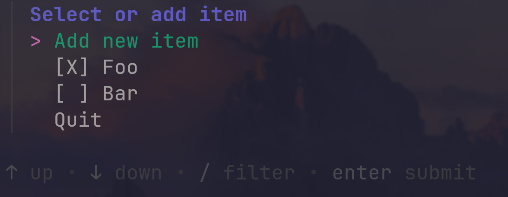

As an exercise to learn some new technologies, I made a to-do MVP app. These are the technologies I wanted to check out:
- [Go](https://go.dev/) - a modern and friendly-to-use programming language
- [Atlas](https://atlasgo.io/) - a tool to declaratively manage your database schemas
- [Nix](https://nixos.org/) and Nix flakes - A reproducible package manager

In this post I give them each a mini-review.

# Architecture

The app consists of a PostgreSQL database inside a container whose schema is managed using Atlas. The CLI app is written in Go with [huh](https://github.com/charmbracelet/huh) for the UI and [pq](https://github.com/lib/pq) to interact with the database. Nix is used as a package manager, for the developer environment and as a container image builder. You can view the code [here](https://github.com/lucasotodegraeve/go-todo-mvp).

<video autoplay muted loop>
  <source src="demo.mp4" type="video/mp4">
</video>

# Go
Go is wonderful language. It gets out of the way and allows you to solve the problem at hand.

I give Go 5 stars!
⭐⭐⭐⭐⭐

# Atlas
While SQL technically follows a declarative paradigm, altering table schemas breaks this property. Atlas attempts to tackle this issue by keeping the current state of your schema as either `hcl` or SQL code. `hcl` is a configuration language that's easy on the eyes.

```hcl
table "users" {
  schema = schema.example
  column "id" {
    null = false
    type = int
  }
  column "name" {
    null = true
    type = varchar(100)
  }
  primary_key {
    columns = [column.id]
  }
}
```

If you want a new column or table, you simply append it to the snippet above. Simple as that. Changing the name of a column will cause the old column to be dropped and a new one created, removing all the data in the process. You first need to perform an `ALTER COLUMN...` before applying the schema using Atlas, which sadly takes the declarative magic away.

Atlas receives 4 stars for now, although I'm sure more pain points will become apparent when it's used to perform migration in production environments.
⭐⭐⭐⭐

# Nix
The promise of Nix is the ability to build and run our code far into the future. No more build errors or missing dependencies. While it does achieve this, a lot is left to be desired. The entire system is quite complex, having a steep learning curve and documentation that's a bit lacking in some places. Despite this, it's still a tool I hope to use more often in the future. No longer having to install different package managers or build from source simply to get the correct version of a package is bliss.

The closest thing I've seen that simply delivers the packages you want is [pkgx](https://pkgx.sh/). And it does this with the simplicity that I wish Nix had. It however has its own quirks and its package repository is not that sizable for the time being.

The process of making a Go package with Nix [Flakes](https://nixos.wiki/wiki/Flakes) is pretty messy. The [documentation](https://nixos.org/manual/nixpkgs/stable/#sec-language-go) on it is again quite short. First, you have to set the `vendorHash` to `null` and run `go mod vendor`. But also don't forget to commit everything or Nix won't be able to see all the files resulting in cryptic errors. When you're ready to release, you can obtain a `vendorHash` by setting it to `lib.fakeHash` and removing the `vendor` folder. And don't forget to commit!

Overall Nix and Flakes, while hard to learn, promise the "It just works" dream. I can't help but feel like every package manager should be more declarative in the future. Therefore it receives a solid 4 stars.
⭐⭐⭐⭐

<a href="https://brainmade.org/">
	
</a>
