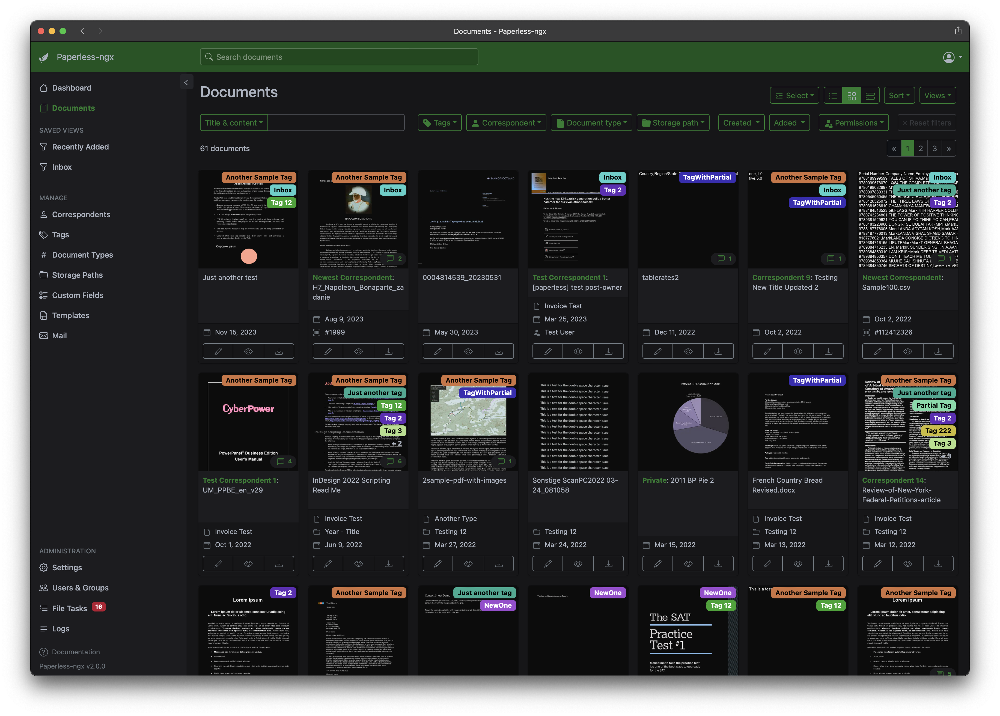

So you want to add [Paperless-ngx](https://docs.paperless-ngx.com/) to [NixOS](https://nixos.org/) with e-mail support enabled? Use the following configuration:

```nix
services.paperless = {
  enable = true;
  passwordFile = "/etc/paperless/password";
  settings = {
    PAPERLESS_AUTO_LOGIN_USERNAME = "admin";
    PAPERLESS_TIKA_ENABLED = true;
  };  
};
```

This is still missing some services to convert `eml` files to `pdf` though, which I couldn't find as Nix packages. The solution is to run them in containers based on [this docker-compose](https://github.com/paperless-ngx/paperless-ngx/blob/main/docker/compose/docker-compose.sqlite-tika.yml) file. First, enable virtualisation (I'm using [podman](https://podman.io/) for this):
    
```nix
virtualisation.podman.enable = true;
virtualisation.podman.defaultNetwork.settings.dns_enabled = true;
```

The second line is needed for the container to be able to access the internet. Next, configure the containers:

```nix
virtualisation.oci-containers = {
  backend = "podman";
  containers.tika = {
    image = "ghcr.io/paperless-ngx/tika:latest";
    autoStart = true;
    ports = ["127.0.0.1:9998:9998"];
  };
  containers.gotenberg = {
    image = "docker.io/gotenberg/gotenberg:7.10";
    autoStart = true;
    ports = ["127.0.0.1:3000:3000"];
    cmd = [
      "gotenberg"
      "--chromium-disable-javascript=true"
      "--chromium-allow-list=file:///tmp/.*"
    ];
  };
};
```
